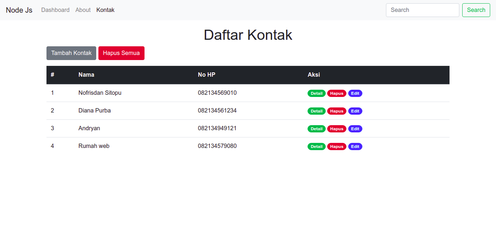

# Contact-app-v.1.2
Aplikasi Contact App meggunakan Node Js dan MongoDb

## Teknologi Yang digunakan
<ul>
  <li> 1. Menggunakan Node Js</li>
  <li> 2. Menggunakan Database Mongo Db </li>
  <li> 3. Menggunakan SweetAlert</li>
  <li> 4. Menggunakan Express Js </li>
</ul>

## Instalasi 
```
git clone https://github.com/Nofrisdan/Contact-app-v.1.2.git
```
:warning: **JIKA ANDA INGIN MENGGUNAKAN APLIKASI INI SILAHKAN MENGHUBUNGI SAYA MELALUI EMAIL nofrisdansitopu22@gmail.com**:

## Cara Menjalankan Aplikasi 
<ul> 
  <li> 1. Silahkan clone aplikasi ini melalui terminal, atau dengan mendwonloadnya melalui tombol code</li>
  <li> 2. Masuk ke dalam folder yang di clone lalu buka terminal dan jalankan perintah npm start</li>
 </ul>
 
## Gambar Aplikasi 

